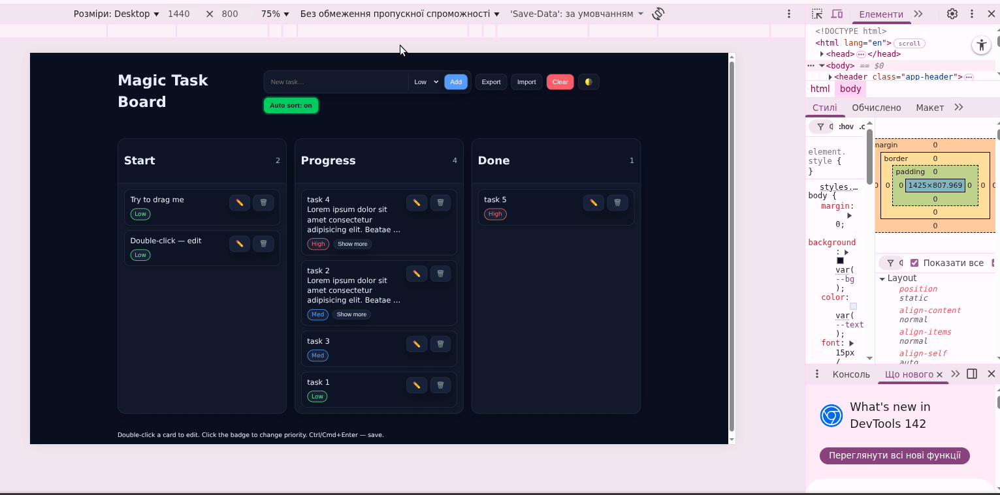

# Magic Task Board — Drag & Drop Task Board

*HTML5 Drag & Drop API · Vanilla JS · LocalStorage · CSS Variables*

**“A magical board for real work: plan with love, move with focus, achieve with ease. Program yourself for success.”**

A lightweight visual task board with drag-and-drop, priorities, dark/light theme, inline editing, JSON export/import, and persistent storage in the browser. No frameworks, no backend.

## Table of Contents
- [Overview](#overview)
- [What I Learned](#what-i-learned)
- [Features](#features)
- [How to Use](#how-to-use)
- [Technical Details](#technical-details)
- [Demo](#demo)
- [Project Structure](#project-structure)

## Overview
**Magic Task Board** is a small single‑page board where you can create cards, **drag** them across columns (*Start / Progress / Done*), set **priority** (Low/Med/High), **edit/delete** items inline, quickly **collapse/expand** long descriptions, **export/import** data as JSON, and toggle **dark/light** theme. Everything runs in the browser with persistent **localStorage** — no server required.

“Implemented a custom HTML5 Drag & Drop with positioning via `getBoundingClientRect()` and a dynamic `drop-indicator`; compute the insertion point in a single pass over the `DOM`.”

“Fully control client-side state: serialize `DOM → JSON`, use `localStorage` with error handling, and support export/import via `Blob/ObjectURL`.”

“UX features: inline editing with auto-resizing `textarea`, `multi-line preview` with overflow measurement (`scrollHeight` vs `clientHeight`), and a ‘Show more / less’ toggle.”

“Themes and preferences persist across sessions; auto sort has a toggle to avoid conflicts with manual `DnD`.”

“No frameworks — clean JS + semantic HTML + CSS variables, keeping the project lightweight, clear, and extensible.”

## What I Learned
- **HTML5 Drag & Drop API**: handling `dragstart/dragover/drop` for cards and columns; dynamic drop‑indicator and exact insertion point.
- **Client‑side state**: serializing the board to `localStorage` (create/update/clear); JSON import/export.
- **UI patterns**:
  - **Dark/Light theme** controlled by CSS variables on `:root` / `:root.light` and a theme toggle button 🌗 (preference saved).
  - Optional **auto sort** by priority (High → Med → Low), with a toggle to keep manual order when off.
  - **Inline editing** via `textarea` (Ctrl/Cmd+Enter — save, Esc — cancel) with auto‑resize.
  - Multi‑line preview using **line‑clamp** + reliable **“Show more / less”** button.
  - **Responsive layout** with `@media` rules for small screens.

## Features
- **Create a task**: enter a title + choose priority (Low/Med/High) → the card appears in *Start*.
- **Drag & Drop**: move cards between columns and within a column; a **drop indicator** shows the insertion point.
- **Priority & Auto Sort**: priority badge cycles Low → Med → High; optional **Auto sort** toggle (on: High→Med→Low; off: keep manual order).
- **Edit/Delete**: double‑click or click ✏️ to edit; click 🗑️ to delete (with confirmation).
- **Show more / less**: long text is clamped to 4 lines with a button to expand/collapse.
- **Dark/Light theme**: toggle 🌗 switches theme (saved across sessions).
- **Export/Import**: export to `kanban-board.json`; import from a JSON file to restore your board.
- **Counters**: each column header shows how many cards it contains.
- **Responsive**: comfortable on mobile (one column layout, centered content, larger hit targets).

## How to Use
1. **Create**: type a task in the header → pick **priority** → click **Add**.
2. **Reorder / Move**: drag a card to a new position or another column; follow the **dashed drop indicator**.
   - If **Auto sort** is **on**, the column will re‑order by priority after changes.
3. **Edit/Delete**:
   - Edit — double‑click or press ✏️.
   - Delete — press 🗑️ and confirm.
4. **Priority**: click the priority badge on a card to cycle **Low → Med → High**.
5. **Long text**: click **Show more** to expand; **Show less** to collapse.
6. **Theme**: press **🌗** to toggle **Dark/Light** (remembered).
7. **Export/Import**:
   - **Export** — saves `kanban-board.json`.
   - **Import** — loads a JSON file (e.g., `kanban-board.json`) and renders it.
8. **Auto sort**: header toggle — when **off**, manual order is preserved; when **on**, cards are ordered by priority.

## Technical Details
- **Drag & Drop**: `dragstart`, `dragover` (with `preventDefault()`), `drop`; insertion point computed by comparing pointer `clientY` with each card’s vertical center (drop indicator shows where it will land).
- **State**: serialized to `localStorage` (`STORE_KEY`), JSON import/export via `Blob` and `URL.createObjectURL()`.
- **Priorities**: visual badges (Low/Med/High) + ranking and optional sort; toggle stored in `localStorage` and reflected with `aria-pressed`.
- **Themes**: `document.documentElement.classList.toggle('light')` switches CSS variables between `:root` and `:root.light`.
- **Long text UX**: CSS `-webkit-line-clamp` (4 lines) with overflow detection (`scrollHeight` vs `clientHeight`) and a “Show more/less” button.
- **Responsive**: `@media (max-width: 840px)` collapses to a single centered column with comfortable spacing.

## Demo
### Desktop


### Mobile (responsive)


## Project Structure
```
.
├── index.html            # Markup: header with form/toggles, 3 columns, card template
├── styles.css            # Dark/Light theme (CSS variables), card styles, responsive rules
├── app.js                # Logic: CRUD, DnD, priorities, line-clamp, export/import, theme
└── kanban-board.json     # Example exported data
```


